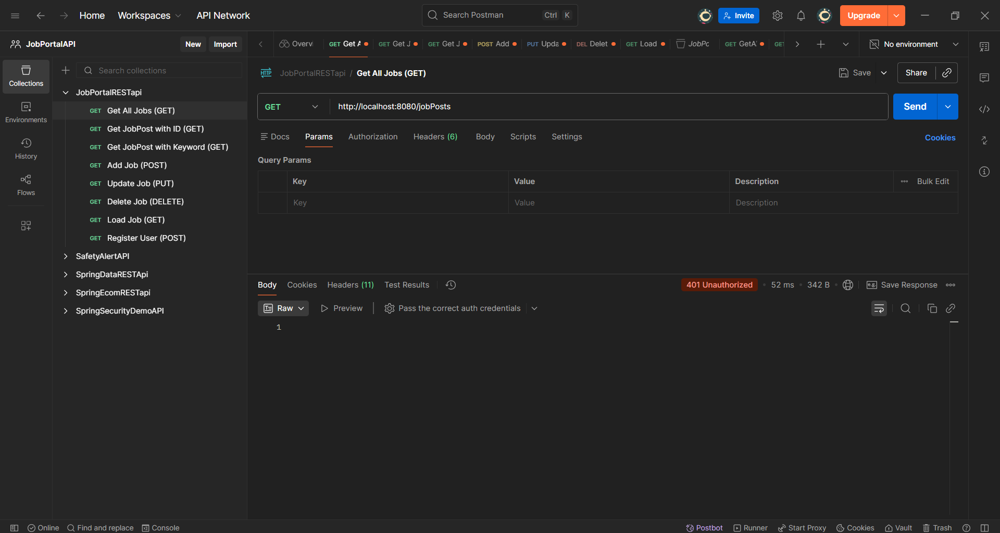
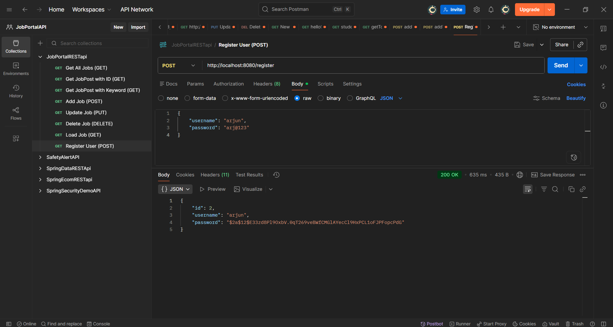
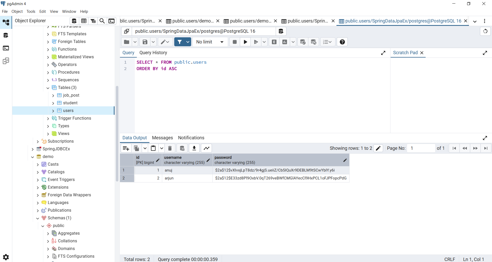

# Job Portal – Spring Boot REST API (Backend Focused)

## 📌 Overview

This project represents the **backend-focused evolution** of my Job Portal application.  
After learning Spring MVC with JSP-based UI, this version was built to understand  
**RESTful backend development**, **database integration**, and **frontend-backend separation**.

The backend is implemented using **Spring Boot REST APIs** and tested using  
**Postman** and an **externally provided React frontend** (course-provided UI).

The React frontend was **not developed by me**, but was used strictly for  
**API integration testing and real-world client–server interaction practice**.

After implementing core APIs and frontend integration, **Spring Security was added**  
to secure REST endpoints and understand real-world backend authentication and authorization flow.

---

## 🎯 What This Project Demonstrates

- RESTful API design using Spring Boot
- Layered architecture (Controller → Service → Repository)
- CRUD operations using Spring Data JPA
- PostgreSQL database integration
- API testing using Postman
- Frontend–backend integration using an externally provided React UI (for testing purposes)
- CORS configuration to allow communication with external frontend clients
- Clean separation of concerns with a backend-only repository

---

## 🛠 Tech Stack

### Backend
- Java 21
- Spring Boot 3
- Spring Web (REST)
- Spring Data JPA
- Spring Security
- PostgreSQL
- Maven

### Security
- Spring Security (Basic Authentication)
- BCrypt Password Encoder

### Testing & Integration
- Postman (API testing)
- React (Frontend – external, not included)

---

## 🧱 Backend Architecture

```text
React UI / Postman
        ↓
 Spring Security Filter Chain
        ↓
   REST Controller
        ↓
     Service Layer
        ↓
   JPA Repository
        ↓
 PostgreSQL Database
 ```
- Spring Security filter intercepts incoming requests

- Authentication is handled before reaching controllers

- REST Controllers expose secured APIs

- Service layer contains business logic

- Repository layer handles database operations

- PostgreSQL is used for persistent storage

---

## 🔗 REST API Endpoints

> All APIs are secured using **Spring Security (Basic Authentication)**  
> except the **user registration endpoint**, which is publicly accessible.

| Method | Endpoint                     | Description                          | Security |
|------|------------------------------|--------------------------------------|----------|
| POST | /register                    | Register new user (BCrypt password)  | 🔓 Public |
| GET  | /jobPosts                    | Get all job posts                    | 🔐 Secured |
| GET  | /jobPost/{postId}            | Get job by ID                        | 🔐 Secured |
| GET  | /jobPosts/keyword/{keyword}  | Search jobs by keyword               | 🔐 Secured |
| POST | /jobPost                     | Add new job                          | 🔐 Secured |
| PUT  | /jobPost                     | Update existing job                  | 🔐 Secured |
| DELETE | /jobPost/{postId}          | Delete job by ID                     | 🔐 Secured |
| GET  | /load                        | Load sample job data                 | 🔐 Secured |
---

## 📸 API & Integration Proof

### 🧪 Database (PostgreSQL)


---

### 🔗 Postman API Testing (Before Security)

🔹 Get All Jobs  


🔹 Get Job By ID  


🔹 Search Job By Keyword  


🔹 Add New Job  


🔹 Update Existing Job  


🔹 Delete Job  


🔹 Initial Data Load  


---

### 🔐 Security Implementation Proof (Spring Security)

🔹 API Access **Before** Basic Authentication  


🔹 API Access **After** Enabling Basic Authentication  


🔹 User Registration (Public Endpoint – No Auth Required)  


🔹 Encrypted Password Stored in Database (BCrypt)  


> Passwords are **never stored in plain text**.  
> BCrypt hashing is applied during user registration.

---

### ⚛️ React Frontend Connected (API Integration Proof)

🏠 Job List Page  


➕ Add New Job  


✏ Update Job  


❌ Job List After Delete  


🔍 Keyword Search  


> React frontend was **provided as part of the course** and used only  
> to test API integration after backend & security implementation.  
> Frontend source code is **not included** to keep this repository backend-focused.


---

## 🗄 Database Configuration

- Database: PostgreSQL
- ORM: Hibernate (via Spring Data JPA)
- DDL Mode: `update`

Sensitive credentials (such as database passwords) are **not hardcoded**  
and are managed using **environment variables**.

---

## 🔐 Security Note

```properties
spring.datasource.password=${DB_PASSWORD}
Database password is stored as an environment variable and not committed to GitHub.
```

## 🧪 Testing Strategy

- All REST APIs tested using Postman

- CRUD operations verified directly in PostgreSQL

- API behavior validated through React frontend integration

- Proper HTTP methods and response codes followed

- Security behavior tested before and after enabling Basic Authentication

## 🔁 Learning Progression

### This project represents a clear learning progression:

#### ➡ Spring MVC + JSP Job Portal (Initial Phase)
#### ➡ Migration to RESTful APIs using Spring Boot
#### ➡ Database integration using Spring Data JPA + PostgreSQL
#### ➡ Frontend-backend separation using React (external frontend)
#### ➡ Securing APIs using Spring Security (Basic Auth + BCrypt)

## 🚀 Project Status
##### ✅ REST APIs implemented
##### ✅ PostgreSQL integration completed
##### ✅ React & Postman tested
##### ✅ Spring Security added (Basic Auth + BCrypt)
##### ✅ Backend learning objectives achieved