# Job Portal – Spring Boot REST API (Backend Focused)

## 📌 Overview
This project represents the **backend-focused evolution** of my Job Portal application.
After learning Spring MVC with JSP-based UI, this version was built to understand
**RESTful backend development**, **database integration**, and **frontend-backend separation**.

The backend is implemented using **Spring Boot REST APIs** and tested using both
**Postman** and a **React frontend**.

---

## 🎯 What This Project Demonstrates

- RESTful API design using Spring Boot
- Layered architecture (Controller → Service → Repository)
- CRUD operations using Spring Data JPA
- PostgreSQL database integration
- API testing using Postman
- Frontend-backend integration using React
- CORS configuration for frontend communication
- Clean separation of concerns (Backend only repo)

---

## 🛠 Tech Stack

### Backend
- Java 21
- Spring Boot 3
- Spring Web (REST)
- Spring Data JPA
- PostgreSQL
- Maven

### Testing & Integration
- Postman (API testing)
- React (Frontend – external, not included)

---

## 🧱 Backend Architecture

```text
React UI / Postman
        ↓
   REST Controller
        ↓
     Service Layer
        ↓
   JPA Repository
        ↓
 PostgreSQL Database
```
- REST Controllers expose APIs
- Service layer contains business logic
- Repository layer handles database operations
- PostgreSQL is used for persistent storage

---

## 🔗 REST API Endpoints

| Method | Endpoint                     | Description                     |
|------|------------------------------|---------------------------------|
| GET  | /jobPosts                    | Get all job posts                |
| GET  | /jobPost/{postId}            | Get job by ID                    |
| GET  | /jobPosts/keyword/{keyword}  | Search jobs by keyword           |
| POST | /jobPost                     | Add new job                      |
| PUT  | /jobPost                     | Update existing job              |
| DELETE | /jobPost/{postId}          | Delete job by ID                 |
| GET  | /load                        | Load sample job data             |

---

## 📸 API & Integration Proof

### 🧪 Database (PostgreSQL)
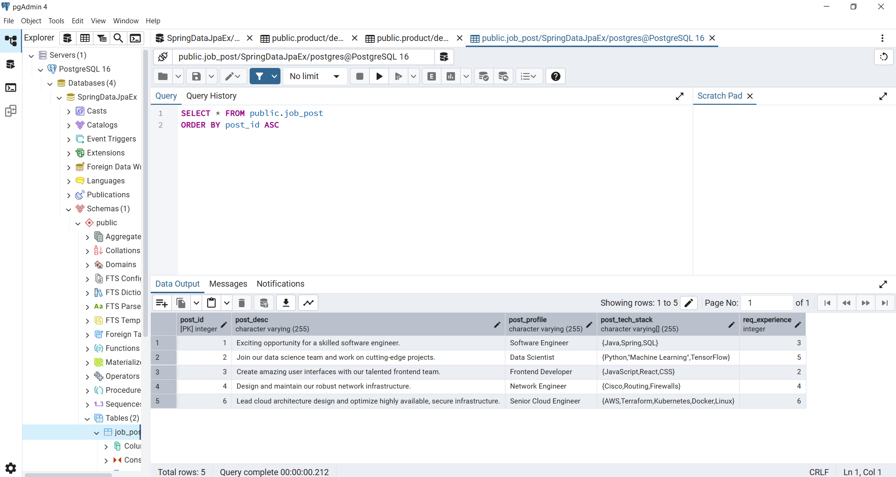

### 🔗 Postman API Testing
🔹 Get All Jobs

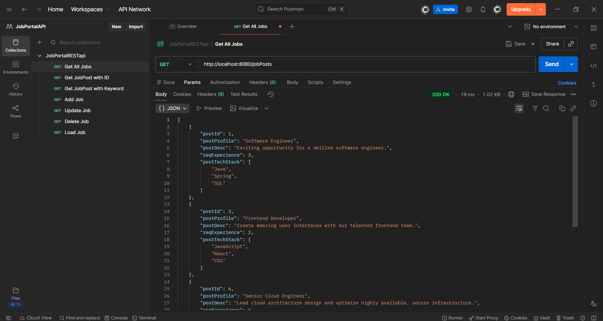

🔹 Get Job By ID

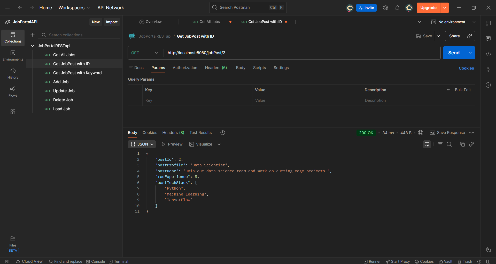

🔹 Search Job By Keyword

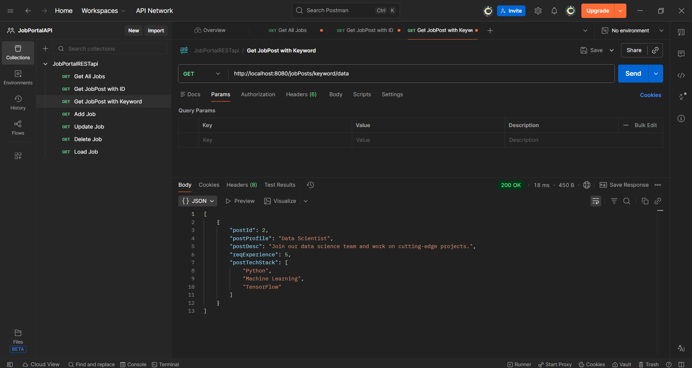

🔹 Add New Job

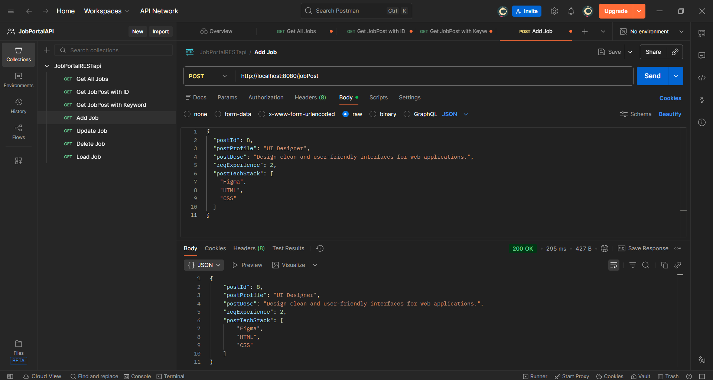

🔹 Update Existing Job

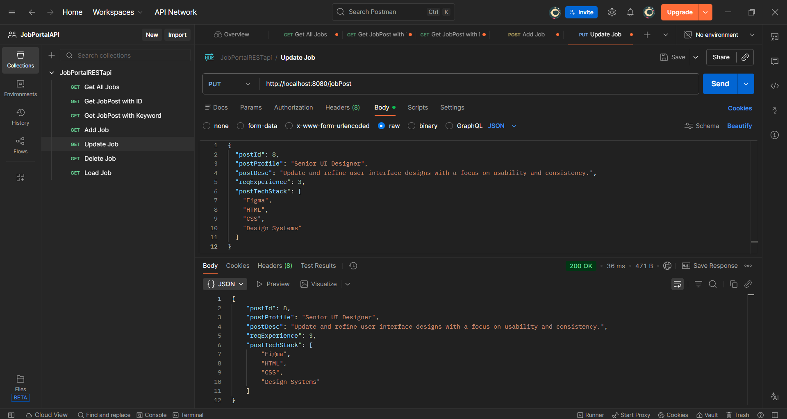

🔹 Delete Job

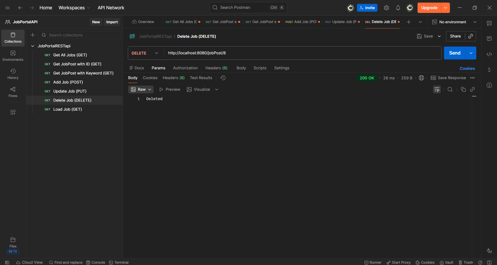

🔹 Initial Data Load

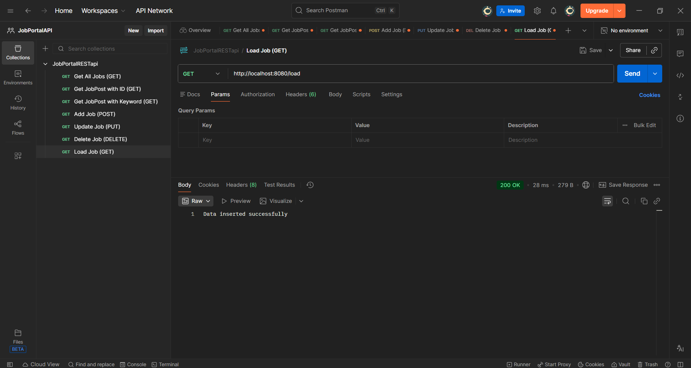

### ⚛️ React Frontend Connected (API Integration Proof)

🏠 Job List Page

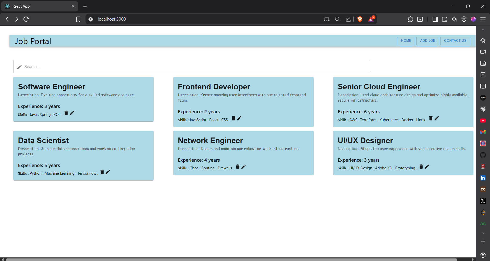

➕ Add New Job

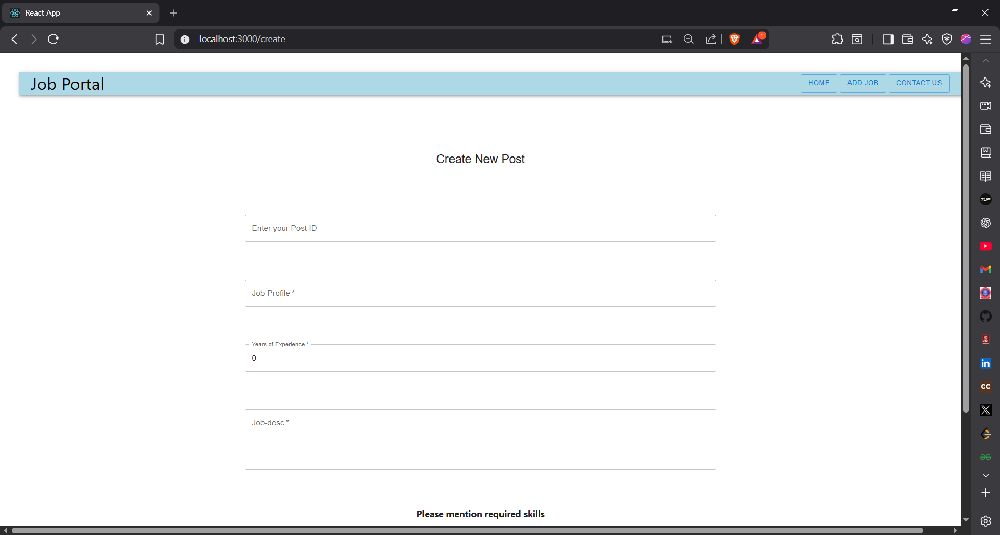

✏ Update Job

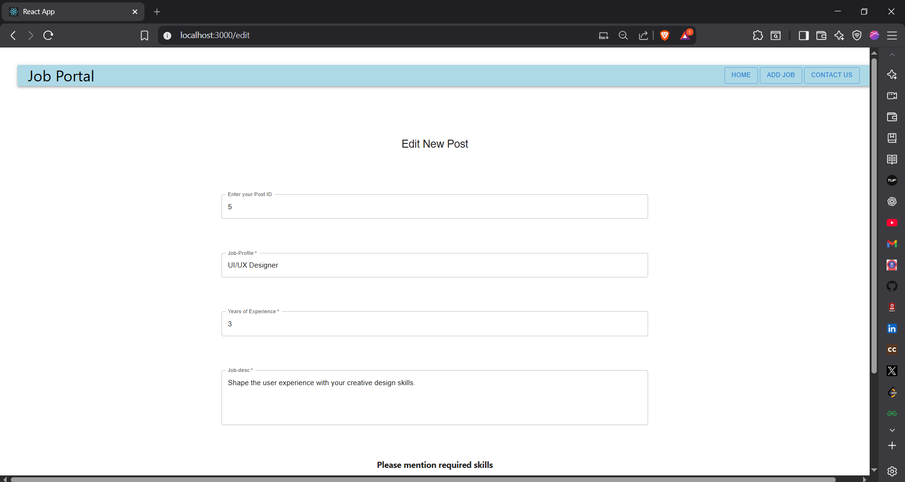

❌ Job List After Delete

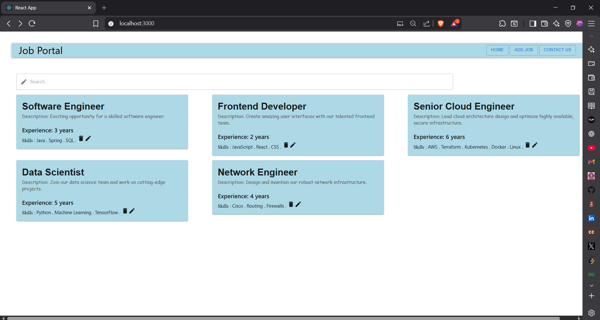

🔍 Keyword Search

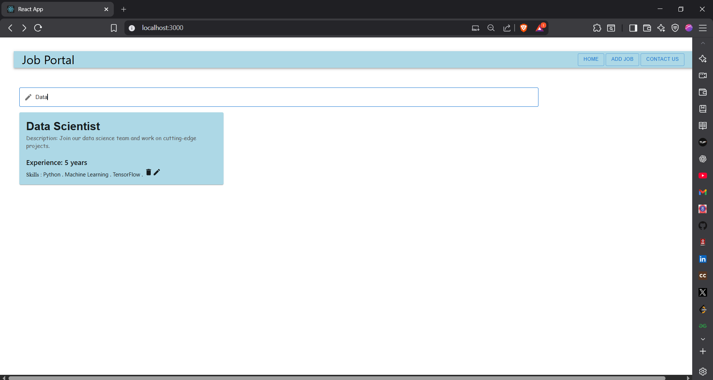

> React frontend is used only for testing API integration.
> Frontend code is intentionally **not included** in this repository
> to keep the focus on backend development.

---

## 🗄 Database Configuration

- Database: PostgreSQL
- ORM: Hibernate (via Spring Data JPA)
- DDL Mode: `update`

Sensitive credentials (like DB password) are **hidden using environment variables**.

---

## 🔐 Security Note

```properties
spring.datasource.password=${DB_PASSWORD}
Database password is stored as an environment variable and not committed to GitHub.
```

## 🧪 Testing Strategy
- All APIs tested using Postman

- CRUD operations verified with PostgreSQL

- API behavior verified via React frontend

- Proper HTTP methods and responses used

## 🔁 Learning Progression
###  This project is a continuation of:

#### ➡ Spring MVC + JSP Job Portal (Initial Phase)
#### ➡ Migrated to REST APIs
#### ➡ Database layer added using JPA + PostgreSQL
#### ➡ Frontend-backend separation using React

Each phase is maintained in separate repositories to clearly show learning growth.

## 🚀 Project Status
##### ✅ REST APIs implemented
##### ✅ PostgreSQL integration completed
##### ✅ React & Postman tested
##### ✅ Backend learning objectives achieved